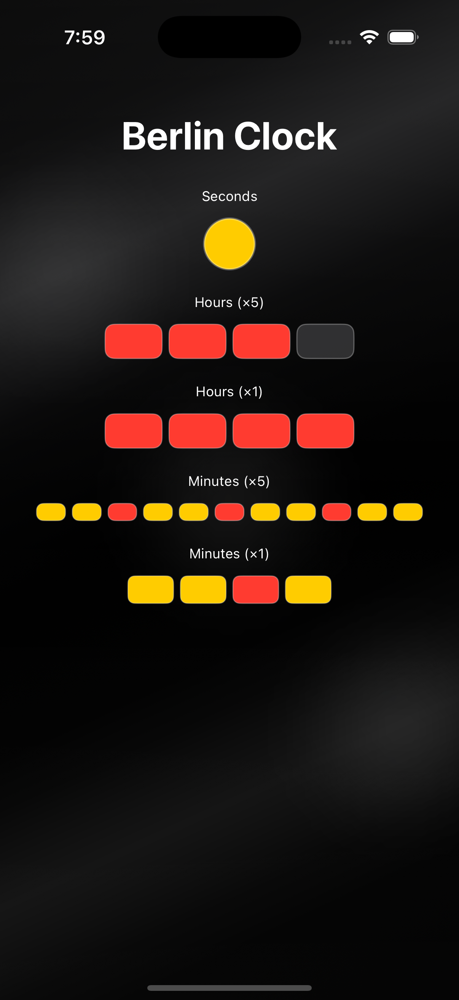

# Berlin Clock (Mengenlehreuhr) – iOS  
### TDD • Clean Architecture • SwiftUI

A production-grade implementation of the Berlin Clock kata built using Test-Driven Development (TDD) and Clean Architecture in Swift / SwiftUI.

This project demonstrates senior-level iOS engineering practices including SOLID principles, MVVM, dependency injection, and comprehensive unit testing.

  

---

## 📌 Overview

The Berlin Clock (German: Mengenlehreuhr) is a clock that represents time using illuminated colored lamps instead of digits.

This application:

- Converts real system time into Berlin Clock format
- Updates every second
- Follows strict TDD (Red → Green → Refactor)
- Maintains high test coverage
- Applies Clean Architecture and SOLID principles

## ⏰ Berlin Clock Rules

The clock contains 5 rows:

| Row | Purpose        | Lamps | Color                        |
| --- | -------------- | ----- | ---------------------------- |
| 1   | Seconds        | 1     | Yellow (on for even seconds) |
| 2   | Five Hours     | 4     | Red                          |
| 3   | Single Hours   | 4     | Red                          |
| 4   | Five Minutes   | 11    | Yellow (Red at 15, 30, 45)   |
| 5   | Single Minutes | 4     | Yellow                       |

### Example: 14:32:17

- Seconds → OFF  
- Five Hours → RR-- (10 hours)  
- Single Hours → RRRR (4 hours)  
- Five Minutes → YYRYYR----- (30 minutes)  
- Single Minutes → YY-- (2 minutes)

## 🏗 Architecture

This project follows Clean Architecture with strict separation of concerns:

UI Layer (SwiftUI Views)
        ↓
Presentation Layer (ViewModel - MVVM)
        ↓
Domain Layer (Business Logic, Models, Protocols)
        ↓
Infrastructure Layer (System integrations)

## 🧪 Testing Strategy

This project was built strictly using TDD.

Red → Green → Refactor Workflow

Write failing tests

Implement minimal code to pass

Refactor safely

Commit each step

### Test Coverage

The project maintains high unit test coverage across all layers:

- **Domain Logic** – Validation of `Time` value object and Berlin clock state
- **Conversion Rules** – Boundary cases (00:00:00, 23:59:59) and edge conditions
- **ViewModel Behavior** – State updates, timer lifecycle, and dependency injection
- **Integration Flows** – End-to-end time → conversion → presentation pipeline
- **Mock-based Time Control** – Deterministic testing via `TimeProvider` abstraction

Coverage: ~90%+

## 📁 Project Structure

BerlinClock/
├── Domain/
├── Presentation/
├── Infrastructure/
├── UI/
└── BerlinClockApp.swift

BerlinClockTests/
├── Domain/
├── Presentation/
├── Infrastructure/
├── Integration/
└── Mocks/

## 🚀 Requirements

- Xcode 16+
- iOS 17+

### Run App
`Cmd + R`

### Run Tests
`Cmd + U`

